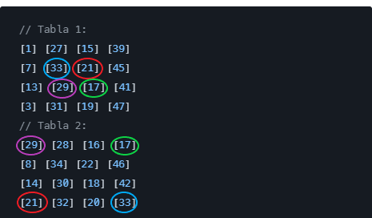

# Lottery Utilities

## Descripción

Esta aplicación es una utilidad de lotería que te permite generar tablas de
loteria automatizada y generada con inputs, algunos de ellos son:

- Figura Comodin
- Cantidad de tablas a generar
- Tamaño de la tabla en cm para el pdf

## Características

- Generación de imagenes de tablas de loteria.
- Generación de PDF con las imagenes generadas.
- Personalización del tamaño de la tabla (cm)
- Personalización del tamaño de la tabla (n\*n)
- Edicion de tablas individuales
- Selector de figuras para insertar en las tablas individuales

---

## Métodos de generación:

##### En la aplicación hay distintos tipos de generación de tablas (todas con figura comodin opcional), por ejemplo:

- Aleatorias usando prand xoroshiro128plus (Estandar automatico)
- Set de 54 tablas con comodín en posición especifica aleatoria (Generar 54
  comodines): Este método genera un set de 54 tablas con un comodín obligatorio,
  que, se puede seleccionar la posición en la que será generada la figura
  comodin.
- Set de 54 tablas con comodín en posición especifica (Generar 54 comodines
  dobles): Este método es igual al anterior solo que el comodin será generado en
  2 posiciones diferentes de la misma tabla.

- Aleatorias + método Centro Esquina (Algoritmo CE): Este método se encarga de
  lo siguiente, en la primera tabla se guardan las figuras del centro, en 4x4
  las 4 figuras centrales, en 5x5 las 5 figuras centrales; y en la siguiente
  tabla, éstas se usan en las esquinas, esta seria una representacion de estas
  tablas:

  

- Aleatorias + método 54 figuras(Generar sets de n): Este método se encarga de
  lo siguiente, va a tomar en cuenta las 54 figuras y las usará en las tablas de
  forma consecuente pero aleatorias, es decir, va a generar `sets de tablas` que
  van contener todas las figuras. Contrario al metodo común, que sería por
  completa aleatoriedad, sin embargo éste tiene un array de las 54 figuras y las
  va desordenando y usando todas hasta que se quede vacio el array y después se
  rellenara con las 54 figuras de nuevo.

---

## Detalles

- Algunas veces hay problemas con el rendimiento de la carga de imagenes, aun
  que están optimizadas, hay momentos en los que quieres generar mas de x tablas
  y solo basta con multiplicar `X * (N * N)` para saber que hay muchas imagenes
  en el DOM.
- Responsive solo para `Width >= 1024px`

---

Diseñado y desarrollado por:
<a href="https://www.github.com/voidexiled">@voidexiled</a>
